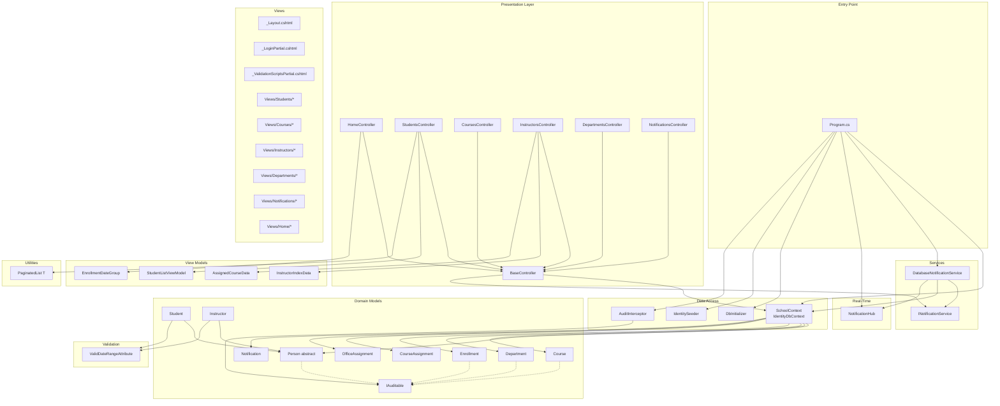

# Component Catalog — Contoso University

_Extracted on 2026-03-26._

## Module Dependency Diagram

---

## Component: Program (Entry Point)

- **Path:** `Program.cs`
- **Type:** Application entry point and composition root
- **Responsibilities:** Configures DI container, middleware pipeline, authentication, database seeding, and endpoint mapping
- **Dependencies:** SchoolContext, DatabaseNotificationService, NotificationHub, DbInitializer, IdentitySeeder, AuditInterceptor
- **Dependents:** None (top-level)
- **Integration points:** SQL Server (connection string), ASP.NET Identity, SignalR

---

## Component: BaseController

- **Path:** `Controllers/BaseController.cs`
- **Type:** Abstract base controller
- **Responsibilities:** Provides shared access to `SchoolContext`, `INotificationService`, and `ILogger` for all entity controllers. Exposes `SendEntityNotificationAsync()` for cross-cutting CRUD notifications with error isolation (try-catch with logging).
- **Dependencies:** `SchoolContext`, `INotificationService`, `ILogger`
- **Dependents:** HomeController, StudentsController, CoursesController, InstructorsController, DepartmentsController, NotificationsController
- **Integration points:** None directly (delegates to injected services)

---

## Component: StudentsController

- **Path:** `Controllers/StudentsController.cs`
- **Type:** MVC controller
- **Responsibilities:** CRUD for Student entities. Index action supports search (by name), multi-column sorting (LastName, EnrollmentDate), and server-side pagination (10 per page). Uses `StudentListViewModel` for strongly-typed view data.
- **Dependencies:** `SchoolContext`, `INotificationService`, `ILogger<StudentsController>` (via BaseController)
- **Dependents:** `Views/Students/*.cshtml`
- **Integration points:** SQL Server (Student/Enrollment/Course queries), Notification service (CREATE/UPDATE/DELETE events)

---

## Component: CoursesController

- **Path:** `Controllers/CoursesController.cs`
- **Type:** MVC controller
- **Responsibilities:** CRUD for Course entities with teaching material image upload. Validates file type (jpg/jpeg/png/gif/bmp) and size (≤5MB). Generates unique filenames, handles file replacement with old-file deletion.
- **Dependencies:** `SchoolContext`, `INotificationService`, `IWebHostEnvironment`, `ILogger<CoursesController>` (via BaseController)
- **Dependents:** `Views/Courses/*.cshtml`
- **Integration points:** SQL Server (Course/Department queries), local filesystem (`wwwroot/Uploads/TeachingMaterials/`), Notification service

---

## Component: InstructorsController

- **Path:** `Controllers/InstructorsController.cs`
- **Type:** MVC controller
- **Responsibilities:** CRUD for Instructor entities with many-to-many course assignment management (checkbox matrix UI) and one-to-one office assignment. Index provides master-detail-detail drill-down (Instructor → Courses → Enrollments). Delete action clears department administrator reference.
- **Dependencies:** `SchoolContext`, `INotificationService`, `ILogger<InstructorsController>` (via BaseController)
- **Dependents:** `Views/Instructors/*.cshtml`
- **Integration points:** SQL Server (Instructor/CourseAssignment/OfficeAssignment/Department queries), Notification service

---

## Component: DepartmentsController

- **Path:** `Controllers/DepartmentsController.cs`
- **Type:** MVC controller
- **Responsibilities:** CRUD for Department entities with optimistic concurrency handling. Edit action catches `DbUpdateConcurrencyException`, compares client vs database values per field, and presents conflict details for user resolution.
- **Dependencies:** `SchoolContext`, `INotificationService`, `ILogger<DepartmentsController>` (via BaseController)
- **Dependents:** `Views/Departments/*.cshtml`
- **Integration points:** SQL Server (Department/Instructor queries with RowVersion concurrency), Notification service

---

## Component: NotificationsController

- **Path:** `Controllers/NotificationsController.cs`
- **Type:** MVC controller + JSON API
- **Responsibilities:** Serves notification dashboard view, provides JSON endpoint for fetching unread notifications (top 10 by date), and marks notifications as read.
- **Dependencies:** `SchoolContext`, `INotificationService`, `ILogger<NotificationsController>` (via BaseController)
- **Dependents:** `Views/Notifications/Index.cshtml`, `wwwroot/Scripts/notifications.js` (polling fallback)
- **Integration points:** SQL Server (Notification queries), INotificationService (MarkAsReadAsync)

---

## Component: HomeController

- **Path:** `Controllers/HomeController.cs`
- **Type:** MVC controller (all actions `[AllowAnonymous]`)
- **Responsibilities:** Serves public pages — Home, About (enrollment statistics via LINQ group-by), Contact, Error, Unauthorized
- **Dependencies:** `SchoolContext`, `INotificationService`, `ILogger<HomeController>` (via BaseController)
- **Dependents:** `Views/Home/*.cshtml`
- **Integration points:** SQL Server (Student enrollment date aggregation query)

---

## Component: SchoolContext

- **Path:** `Data/SchoolContext.cs`
- **Type:** EF Core database context (inherits `IdentityDbContext`)
- **Responsibilities:** Defines 9 DbSets, configures TPH inheritance (Person → Student/Instructor), composite keys (CourseAssignment), relationships (one-to-one, one-to-many), datetime2 column type convention, and table name mappings. Includes ASP.NET Identity tables via IdentityDbContext base class.
- **Dependencies:** All entity models (Course, Enrollment, Department, OfficeAssignment, CourseAssignment, Person, Student, Instructor, Notification)
- **Dependents:** All controllers (via BaseController), DatabaseNotificationService, DbInitializer, AuditInterceptor, IdentitySeeder
- **Integration points:** SQL Server via `UseSqlServer()` connection

---

## Component: DatabaseNotificationService

- **Path:** `Services/DatabaseNotificationService.cs`
- **Type:** Business logic service (implements `INotificationService`)
- **Responsibilities:** Creates Notification records in the database with entity type, ID, operation, message, and user metadata. After persistence, broadcasts the notification to all connected SignalR clients. Provides read-status management via `MarkAsReadAsync`.
- **Dependencies:** `SchoolContext`, `IHubContext<NotificationHub>`, `ILogger<DatabaseNotificationService>`
- **Dependents:** BaseController (via INotificationService interface)
- **Integration points:** SQL Server (Notification table), SignalR (broadcast to all clients)

---

## Component: NotificationHub

- **Path:** `Hubs/NotificationHub.cs`
- **Type:** ASP.NET Core SignalR hub
- **Responsibilities:** WebSocket endpoint for real-time notification delivery. Minimal implementation — no custom server methods. Server pushes messages via `IHubContext<NotificationHub>` from `DatabaseNotificationService`.
- **Dependencies:** None (framework-managed)
- **Dependents:** `DatabaseNotificationService` (via `IHubContext<NotificationHub>`), `wwwroot/Scripts/notifications.js` (client connection)
- **Integration points:** WebSocket connections at `/notificationHub`

---

## Component: AuditInterceptor

- **Path:** `Data/AuditInterceptor.cs`
- **Type:** EF Core SaveChangesInterceptor
- **Responsibilities:** Intercepts all `SaveChanges`/`SaveChangesAsync` calls. For entities implementing `IAuditable`: sets `CreatedAt` and `CreatedBy` on insert; sets `ModifiedAt` and `ModifiedBy` on insert and update. Reads the current username from `IHttpContextAccessor`.
- **Dependencies:** `IHttpContextAccessor`
- **Dependents:** SchoolContext (registered via `AddInterceptors()` in Program.cs)
- **Integration points:** ASP.NET Core HTTP context (user identity)

---

## Component: DbInitializer

- **Path:** `Data/DbInitializer.cs`
- **Type:** Static seed data initializer
- **Responsibilities:** Calls `EnsureCreated()` to create the database if missing. Seeds 8 students, 5 instructors, 4 departments, 7 courses, 3 office assignments, 8 course-instructor assignments, and 11 enrollments with grades. Skips seeding if students already exist.
- **Dependencies:** `SchoolContext`, all entity models
- **Dependents:** `Program.cs` (called at startup)
- **Integration points:** SQL Server (DDL + INSERT operations)

---

## Component: IdentitySeeder

- **Path:** `Data/IdentitySeeder.cs`
- **Type:** Static identity seed initializer
- **Responsibilities:** Creates three roles (Admin, Faculty, ReadOnly) and one admin user (`admin@contoso.edu` / `Admin123!`) with the Admin role. Skips if already exists.
- **Dependencies:** `RoleManager<IdentityRole>`, `UserManager<IdentityUser>` (resolved from `IServiceProvider`)
- **Dependents:** `Program.cs` (called at startup)
- **Integration points:** SQL Server (ASP.NET Identity tables)

---

## Component: PaginatedList\<T\>

- **Path:** `PaginatedList.cs`
- **Type:** Generic utility class
- **Responsibilities:** Provides server-side pagination via `CreateAsync()` — executes `CountAsync()` and `Skip().Take().ToListAsync()` on an `IQueryable<T>` source. Exposes `Items`, `PageIndex`, `TotalPages`, `HasPreviousPage`, `HasNextPage`.
- **Dependencies:** `Microsoft.EntityFrameworkCore` (for async LINQ)
- **Dependents:** `StudentsController` (via `StudentListViewModel`), `Views/Students/Index.cshtml`
- **Integration points:** None (operates on IQueryable)

---

## Component: ValidDateRangeAttribute

- **Path:** `Models/Validation/ValidDateRangeAttribute.cs`
- **Type:** Custom validation attribute
- **Responsibilities:** Validates that a `DateTime` value is not `MinValue`/`default` and falls within the SQL Server datetime range (1753-01-01 to 9999-12-31).
- **Dependencies:** `System.ComponentModel.DataAnnotations`
- **Dependents:** `Student.EnrollmentDate`, `Instructor.HireDate`
- **Integration points:** None (pure validation logic)

---

## Component: Domain Models

- **Path:** `Models/`
- **Type:** Entity classes and interfaces

| Model | Table | Key | Implements | Navigation Properties |
|-------|-------|-----|------------|----------------------|
| Person (abstract) | Person | ID (identity) | IAuditable | — |
| Student : Person | Person (TPH) | ID | IAuditable (inherited) | Enrollments |
| Instructor : Person | Person (TPH) | ID | IAuditable (inherited) | CourseAssignments, OfficeAssignment |
| Course | Course | CourseID (manual) | IAuditable | Department, Enrollments, CourseAssignments |
| Department | Department | DepartmentID (identity) | IAuditable | Administrator (Instructor), Courses |
| Enrollment | Enrollment | EnrollmentID (identity) | IAuditable | Course, Student |
| CourseAssignment | CourseAssignment | (CourseID, InstructorID) | — | Course, Instructor |
| OfficeAssignment | OfficeAssignment | InstructorID (1:1) | — | Instructor |
| Notification | Notification | Id (identity) | — | — |

---

## Component: View Models

| View Model | Path | Used By | Properties |
|-----------|------|---------|------------|
| StudentListViewModel | `Models/ViewModels/` | StudentsController.Index | Students (PaginatedList), CurrentSort, CurrentFilter, NameSortParm, DateSortParm |
| InstructorIndexData | `Models/SchoolViewModels/` | InstructorsController.Index | Instructors, Courses, Enrollments (for master-detail-detail drill-down) |
| EnrollmentDateGroup | `Models/SchoolViewModels/` | HomeController.About | EnrollmentDate, StudentCount |
| AssignedCourseData | `Models/SchoolViewModels/` | InstructorsController.Create/Edit | CourseID, Title, Assigned (bool) |
| ErrorViewModel | `Models/` | Error view | RequestId, ShowRequestId |

---

## Component: Client-Side Assets

| File | Purpose | Dependencies |
|------|---------|-------------|
| `wwwroot/Scripts/jquery-3.4.1.min.js` | DOM manipulation, AJAX | — |
| `wwwroot/Scripts/bootstrap.min.js` | UI components | jQuery |
| `wwwroot/Scripts/jquery.validate.min.js` | Client-side form validation | jQuery |
| `wwwroot/Scripts/jquery.validate.unobtrusive.min.js` | Data-annotation-driven validation | jQuery, jQuery Validate |
| `wwwroot/Scripts/notifications.js` | SignalR connection + toast notification UI | SignalR JS client (CDN) |
| `wwwroot/Content/bootstrap.min.css` | CSS framework (5.3.3) | — |
| `wwwroot/Content/Site.css` | Custom styles | — |
| `wwwroot/Content/notifications.css` | Notification toast styles | — |
| CDN: `signalr.min.js` v8.0.0 | SignalR client library | — |
