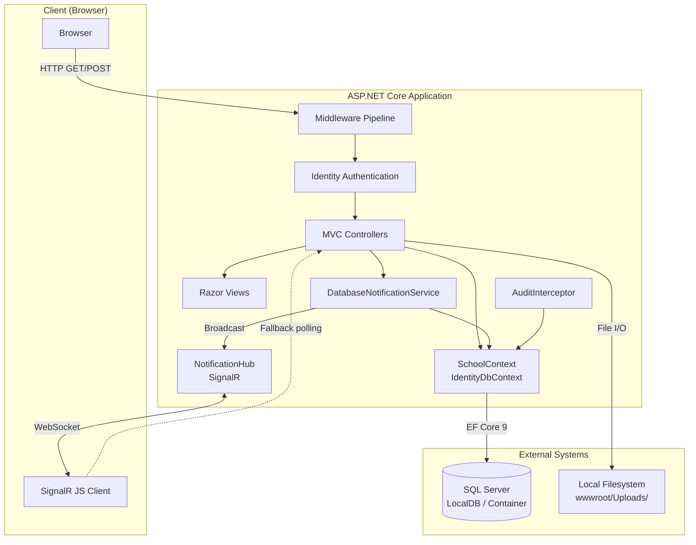
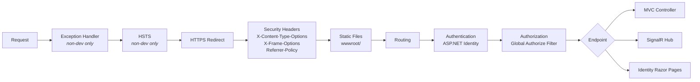
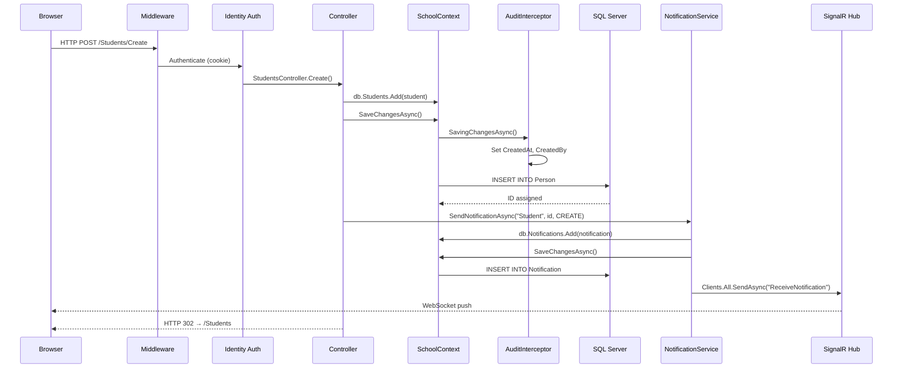
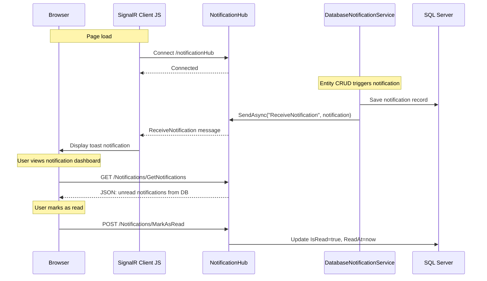
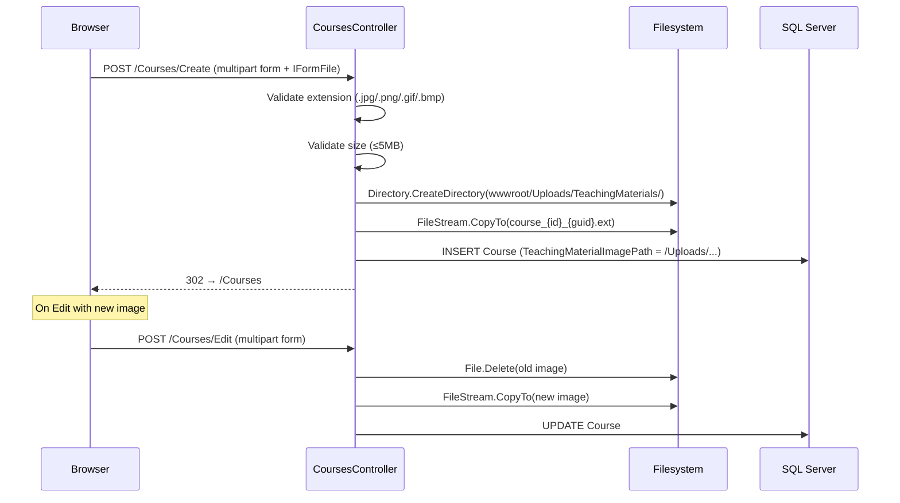
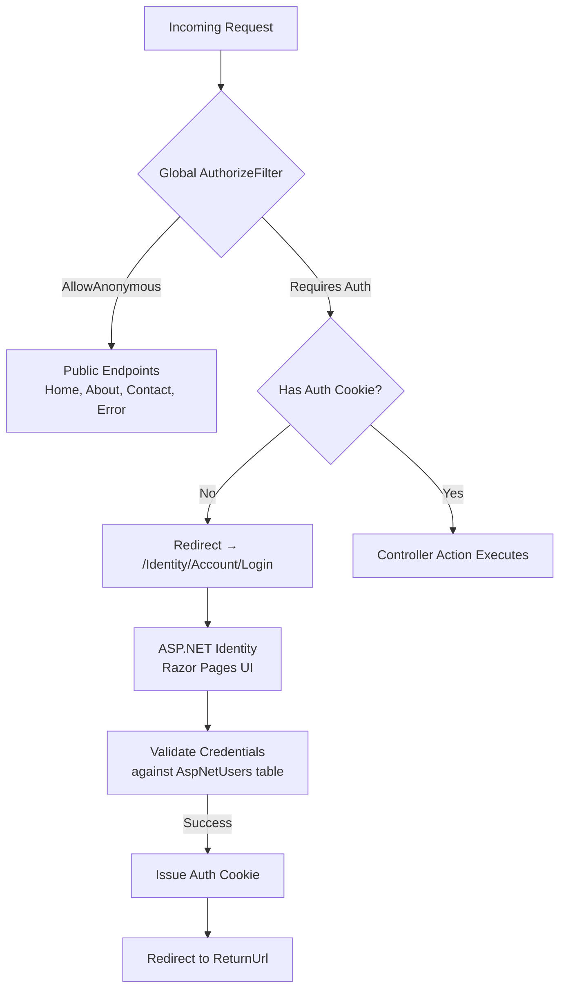
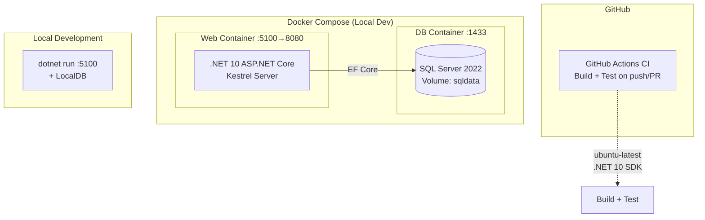

# Architecture Overview — Contoso University

_Extracted on 2026-03-26. Documents the architecture as it exists in the modernized codebase (.NET 10)._

## System Boundaries

| Application | Runtime | Entry Point | Deployment Artifact |
|-------------|---------|-------------|---------------------|
| Contoso University Web | .NET 10 (ASP.NET Core MVC) | `Program.cs` | Docker container (`mcr.microsoft.com/dotnet/aspnet:10.0`) |

Single deployable unit (monolith). One project (`ContosoUniversity.csproj`) serving HTML views, JSON API endpoints, and a SignalR WebSocket hub from a single ASP.NET Core process.

A companion xUnit test project (`ContosoUniversity.Tests.csproj`) exists for build-time verification but is not deployed.

## High-Level Architecture



The application follows the **MVC (Model-View-Controller)** pattern with ASP.NET Core conventions. Controllers serve as the primary request handlers, accessing the database through a shared EF Core `SchoolContext` (registered as a scoped service via DI). A cross-cutting notification system spans from controller actions through a `DatabaseNotificationService` to a SignalR hub for real-time client updates. An EF Core `SaveChangesInterceptor` applies audit metadata to all entities implementing `IAuditable`.

## Middleware Pipeline

Requests flow through the middleware pipeline in this order:



## Data Flow

### Primary CRUD Request Flow



### SignalR Notification Flow



### File Upload Flow (Courses)



## Authentication & Authorization Flow



Three roles are seeded: **Admin**, **Faculty**, **ReadOnly**. The global `[Authorize]` filter requires authentication on all controllers except those marked `[AllowAnonymous]` (HomeController, NotificationsController.GetNotifications).

## Integration Points

| Type | Technology | Used By | Config Source |
|------|-----------|---------|---------------|
| Database | SQL Server (LocalDB or Container) | SchoolContext (all controllers, services) | `ConnectionStrings:DefaultConnection` in appsettings.json; overridable via environment variable |
| Real-time messaging | ASP.NET Core SignalR | DatabaseNotificationService → NotificationHub → Browser JS | Endpoint: `/notificationHub` (mapped in Program.cs) |
| Authentication store | ASP.NET Identity (SQL Server) | Identity middleware, _LoginPartial, IdentitySeeder | Shared SchoolContext (IdentityDbContext) |
| File system | Local disk (wwwroot/) | CoursesController (teaching material uploads) | `IWebHostEnvironment.WebRootPath` + `/Uploads/TeachingMaterials/` |
| CI/CD | GitHub Actions | `.github/workflows/ci.yml` | Triggers on push/PR to main/final-solution |
| Container runtime | Docker (multi-stage) | Dockerfile + docker-compose.yml | SQL Server container on port 1433; app on port 8080→5100 |
| CDN | cdnjs.cloudflare.com | _Layout.cshtml (SignalR client library v8.0.0) | Hardcoded script src in layout |

## Dependency Injection Container

| Registration | Interface | Implementation | Lifetime |
|-------------|-----------|----------------|----------|
| HTTP context | `IHttpContextAccessor` | Framework built-in | Scoped |
| Audit interceptor | `AuditInterceptor` | `AuditInterceptor` | Scoped |
| Database context | `SchoolContext` | `SchoolContext` (IdentityDbContext) | Scoped |
| Identity | `UserManager<IdentityUser>`, `SignInManager<IdentityUser>`, `RoleManager<IdentityRole>` | ASP.NET Identity | Scoped |
| Notification service | `INotificationService` | `DatabaseNotificationService` | Scoped |
| SignalR | `IHubContext<NotificationHub>` | Framework built-in | Singleton |
| Logging | `ILogger<T>` | Framework built-in | Transient |
| Environment | `IWebHostEnvironment` | Framework built-in | Singleton |

## Architectural Patterns Observed

### MVC (Model-View-Controller)
Six controllers handle HTTP requests, delegating to EF Core for data access and returning Razor views. Evidence: `Controllers/` directory with `*Controller.cs` files inheriting from a shared `BaseController`, paired with `Views/{ControllerName}/` directories containing `.cshtml` templates.

### Base Controller Pattern
All entity controllers inherit from `BaseController`, which provides shared access to `SchoolContext`, `INotificationService`, and `ILogger` via constructor injection. Evidence: `Controllers/BaseController.cs` abstract class with three constructor parameters propagated to all six concrete controllers.

### Table-per-Hierarchy (TPH) Inheritance
`Person` is an abstract base class mapped to a single `Person` database table. `Student` and `Instructor` are discriminated by a `Discriminator` column. Evidence: `SchoolContext.OnModelCreating()` configures `.HasDiscriminator<string>("Discriminator").HasValue<Student>("Student").HasValue<Instructor>("Instructor")`.

### Repository-less Data Access
Controllers access `SchoolContext` directly — no repository or unit-of-work abstraction layer exists between controllers and EF Core. Evidence: all controllers reference `db.Students`, `db.Courses`, etc. directly (field inherited from `BaseController`).

### Cross-Cutting Notification via Base Class
Entity CRUD notifications are implemented as a protected method on `BaseController` (`SendEntityNotificationAsync`), called explicitly in each controller's Create/Edit/Delete actions. Evidence: all six controllers call `SendEntityNotificationAsync()` after `SaveChangesAsync()`.

### Interceptor-Based Auditing
An EF Core `SaveChangesInterceptor` (`AuditInterceptor`) automatically populates `CreatedAt`, `ModifiedAt`, `CreatedBy`, and `ModifiedBy` on all `IAuditable` entities during save operations. Evidence: `Data/AuditInterceptor.cs` registered in `Program.cs` via `AddInterceptors()`.

### Real-Time Push via SignalR
Server-to-client notifications use ASP.NET Core SignalR. The `DatabaseNotificationService` broadcasts to all connected clients after persisting a notification. The browser connects via the `@microsoft/signalr` JS client library with automatic reconnect and a polling fallback. Evidence: `Hubs/NotificationHub.cs`, `DatabaseNotificationService` calling `_hubContext.Clients.All.SendAsync()`, `wwwroot/Scripts/notifications.js` connecting to `/notificationHub`.

### Optimistic Concurrency (Department Only)
The `Department` entity uses a `[Timestamp] byte[] RowVersion` property for optimistic concurrency detection. `DepartmentsController.Edit()` catches `DbUpdateConcurrencyException` and presents field-level conflict details. Evidence: `Models/Department.cs` RowVersion property, `DepartmentsController.cs` catch block with `GetDatabaseValues()` comparison.

## Entity Relationship Diagram

```mermaid
erDiagram
    Person {
        int ID PK
        string LastName
        string FirstName
        string Discriminator
        datetime2 CreatedAt
        datetime2 ModifiedAt
        string CreatedBy
        string ModifiedBy
    }
    Student {
        datetime2 EnrollmentDate
    }
    Instructor {
        datetime2 HireDate
    }
    Course {
        int CourseID PK
        string Title
        int Credits
        int DepartmentID FK
        string TeachingMaterialImagePath
    }
    Department {
        int DepartmentID PK
        string Name
        decimal Budget
        datetime2 StartDate
        int InstructorID FK
        binary RowVersion
    }
    Enrollment {
        int EnrollmentID PK
        int CourseID FK
        int StudentID FK
        string Grade
    }
    CourseAssignment {
        int CourseID PK_FK
        int InstructorID PK_FK
    }
    OfficeAssignment {
        int InstructorID PK_FK
        string Location
    }
    Notification {
        int Id PK
        string EntityType
        string EntityId
        string Operation
        string Message
        datetime2 CreatedAt
        string CreatedBy
        bit IsRead
        datetime2 ReadAt
    }

    Person ||--o{ Student : "TPH"
    Person ||--o{ Instructor : "TPH"
    Student ||--o{ Enrollment : "has"
    Course ||--o{ Enrollment : "has"
    Course }o--|| Department : "belongs to"
    Course ||--o{ CourseAssignment : "has"
    Instructor ||--o{ CourseAssignment : "has"
    Instructor ||--o| OfficeAssignment : "has"
    Department }o--o| Instructor : "administered by"
```

## Deployment Topology



Two deployment modes exist:
1. **Local development**: `dotnet run` with SQL Server LocalDB (`(LocalDb)\MSSQLLocalDB`)
2. **Docker Compose**: Multi-container with SQL Server 2022 container and app container on a shared Docker network
